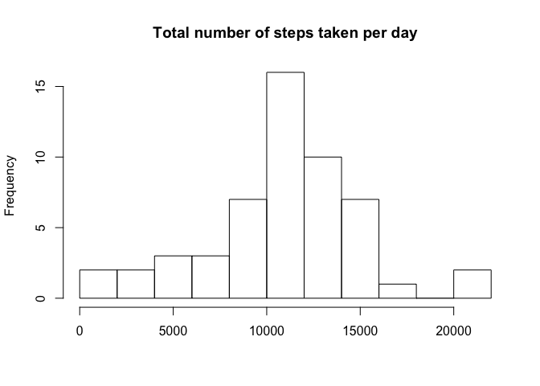
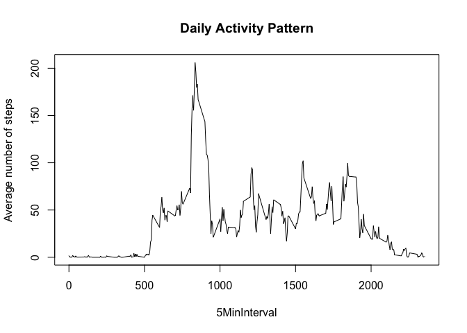
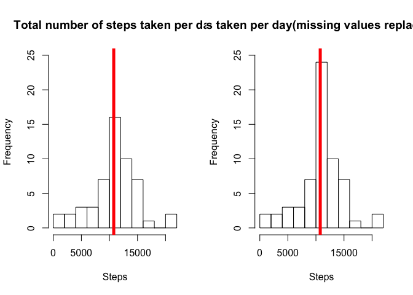
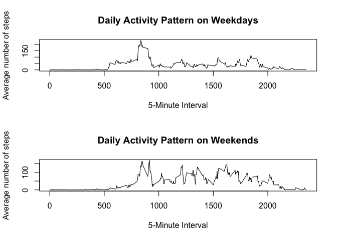

# Reproducible Research: Peer Assessment 1


## Loading and preprocessing the data
First I`m going to load the file into a variable, called data(I have already unzipped it).
I may need to see what does the data set looks like, so I`m calling the head function.

```r
data<-read.csv("./activity.csv")
head(data)
```

```
##   steps       date interval
## 1    NA 2012-10-01        0
## 2    NA 2012-10-01        5
## 3    NA 2012-10-01       10
## 4    NA 2012-10-01       15
## 5    NA 2012-10-01       20
## 6    NA 2012-10-01       25
```

We also need to bring the "date" parametre to the actual date type with the following code
## What is mean total number of steps taken per day?

```r
data$date=as.Date(data$"date")
```

For this part of the assignment, according to the given orders,I can ignore the missing values in the dataset

```r
data_withoutNA<-data[which(!is.na(data$"steps")),]
head(data_withoutNA)
```

```
##     steps       date interval
## 289     0 2012-10-02        0
## 290     0 2012-10-02        5
## 291     0 2012-10-02       10
## 292     0 2012-10-02       15
## 293     0 2012-10-02       20
## 294     0 2012-10-02       25
```
Now lets calculate number of steps per day and save it all in StepsPerDay

```r
StepsPerDay<-tapply(data_withoutNA$"steps",data_withoutNA$"date", sum)
StepsPerDay
```

```
## 2012-10-02 2012-10-03 2012-10-04 2012-10-05 2012-10-06 2012-10-07 
##        126      11352      12116      13294      15420      11015 
## 2012-10-09 2012-10-10 2012-10-11 2012-10-12 2012-10-13 2012-10-14 
##      12811       9900      10304      17382      12426      15098 
## 2012-10-15 2012-10-16 2012-10-17 2012-10-18 2012-10-19 2012-10-20 
##      10139      15084      13452      10056      11829      10395 
## 2012-10-21 2012-10-22 2012-10-23 2012-10-24 2012-10-25 2012-10-26 
##       8821      13460       8918       8355       2492       6778 
## 2012-10-27 2012-10-28 2012-10-29 2012-10-30 2012-10-31 2012-11-02 
##      10119      11458       5018       9819      15414      10600 
## 2012-11-03 2012-11-05 2012-11-06 2012-11-07 2012-11-08 2012-11-11 
##      10571      10439       8334      12883       3219      12608 
## 2012-11-12 2012-11-13 2012-11-15 2012-11-16 2012-11-17 2012-11-18 
##      10765       7336         41       5441      14339      15110 
## 2012-11-19 2012-11-20 2012-11-21 2012-11-22 2012-11-23 2012-11-24 
##       8841       4472      12787      20427      21194      14478 
## 2012-11-25 2012-11-26 2012-11-27 2012-11-28 2012-11-29 
##      11834      11162      13646      10183       7047
```

Now let us make a histogram of the total number of steps taken each day


```r
hist(StepsPerDay,breaks=10, main = "Total number of steps taken per day", xlab = "")
```



And now, finally, I will calculate the mean and median of the total number of steps taken per day.

```r
mean(StepsPerDay)
```

```
## [1] 10766.19
```

```r
median(StepsPerDay)
```

```
## [1] 10765
```

## What is the average daily activity pattern?
In order to explore our data during the day, I will need to aggregate the dataset by the intervals. I also have to make a time series plot (i.e. 𝚝𝚢𝚙𝚎 = "𝚕") of the 5-minute interval (x-axis) and the average number of steps taken, averaged across all days (y-axis)

```r
AvgDayActiv<-tapply(data_withoutNA$steps, data_withoutNA$interval, mean)
plot(y = AvgDayActiv, x = names(AvgDayActiv), type = "l", xlab = "5MinInterval",main = "Daily Activity Pattern", ylab = "Average number of steps")
```



So,which 5-minute interval, on average across all the days in the dataset, contains the maximum number of steps?

```r
AvgDayActiv[AvgDayActiv==max(AvgDayActiv)]
```

```
##      835 
## 206.1698
```


## Imputing missing values
First I need to calculate and report the total number of missing values in the dataset (i.e. the total number of rows with 𝙽𝙰s)


```r
sum(is.na(data))
```

```
## [1] 2304
```

```r
sum(is.na(data$"steps"))
```

```
## [1] 2304
```
Let`s devise a strategy for filling in all of the missing values in the dataset. For example, I can use  the mean for that 5-minute interval. So I will now create a new dataset that is equal to the original dataset but with the missing data filled in by the mean for the 5-minute interval.

```r
data2<-data
data2[which(is.na(data2$steps)),1]<-AvgDayActiv[as.character(data2[which(is.na(data2$steps)),3])]
sum(is.na(data2))
```

```
## [1] 0
```

Now lets make a histograme for this new dataset and see if there are any big effect


```r
StepsPerDay2<-tapply(data2$"steps",data2$"date", sum)

par(mfrow=c(1,2))
hist(StepsPerDay,breaks=10, main = "Total number of steps taken per day", xlab = "Steps",ylim=c(0,25))
abline(v=median(StepsPerDay),col=10,lwd=5)
hist(StepsPerDay2,breaks=10, main = "Total number of steps taken per day(missing values replaced with mean of interval", xlab = "Steps",ylim=c(0,25))
abline(v=median(StepsPerDay2),col=10,lwd=5)
```



Now let`s see what is median and mean of the new dataset

```r
mean(StepsPerDay2)
```

```
## [1] 10766.19
```

```r
median(StepsPerDay2)
```

```
## [1] 10766.19
```

As we see difference is minimum, mean is same and median is changed just a bit

## Are there differences in activity patterns between weekdays and weekends?

Here we create two more columns to the dataset, that will help us distinguish week days and weekend


```r
data2$wd<-weekdays(data2$date)
data2$fwd<- as.factor(c("weekend", "weekday"))
data2[data2$wd == "Sunday" | data2$wd == "Saturday" ,5]<- factor("weekend")
data2[!(data2$wd == "Sunday" | data2$wd == "Saturday"),5 ]<- factor("weekday")
```

Now I`ll create create 2 arrays that will show average numbers of steps per 5-minute time intervals separately for weekdays and week ends


```r
DataWend <- subset(data2, fwd == "weekend") 
DataWday <- subset(data2, fwd == "weekday") 
AvgDayActivWend<-tapply(DataWend$steps, DataWend$interval, mean)
AvgDayActivWday<-tapply(DataWday$steps, DataWday$interval, mean)
par(mfrow=c(2,1))
plot(y = AvgDayActivWday, x = names(AvgDayActivWday), type = "l", xlab = "5-Minute Interval", main = "Daily Activity Pattern on Weekdays", ylab = "Average number of steps")
plot(y = AvgDayActivWend, x = names(AvgDayActivWend), type = "l", xlab = "5-Minute Interval",main = "Daily Activity Pattern on Weekends", ylab = "Average number of steps")
```



From these plots we can observe that on average on weekends the example person starts to have some activity later then on weekdays.During the whole weekend (after waking up may be) he/she shows kind of same level activity. On weekdays we can see a jumo in activity in same particular time and we can assume that may be he/she is walking to job at that time, but coming back using any kind fo transportation.
